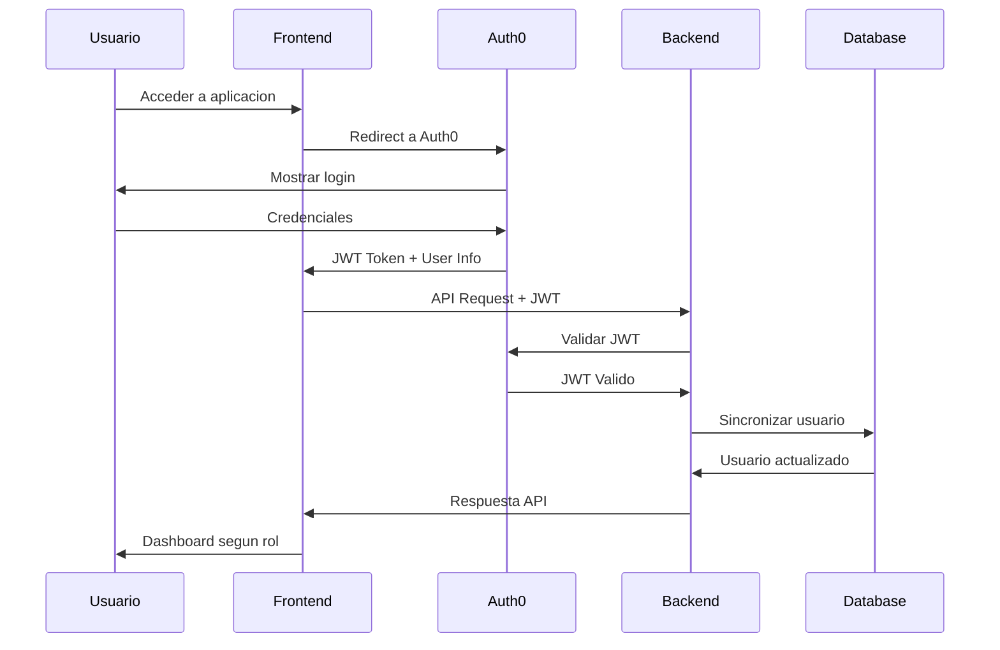

# Arquitectura del Sistema - Barbería

## 📁 Estructura del Proyecto

```
Barberia/
├── backend/                          # Spring Boot Application
│   ├── src/main/java/com/barberia/
│   │   ├── BarberiaApplication.java   # Clase principal
│   │   ├── base/                      # Clases base reutilizables
│   │   │   ├── BaseEntity.java        # Entidad base con auditoria
│   │   │   ├── BaseRepository.java    # Repositorio generico
│   │   │   ├── BaseService.java       # Servicio base CRUD
│   │   │   └── BaseController.java    # Controlador base REST
│   │   ├── config/                    # Configuraciones del sistema
│   │   │   ├── SecurityConfig.java    # Configuracion de seguridad
│   │   │   └── AudienceValidator.java # Validador de JWT
│   │   ├── auth/                      # Modulo de autenticacion
│   │   │   ├── controller/AuthController.java
│   │   │   └── service/AuthService.java
│   │   ├── user/                      # Modulo de usuarios
│   │   │   ├── entity/User.java
│   │   │   ├── repository/UserRepository.java
│   │   │   ├── service/UserService.java
│   │   │   ├── controller/UserController.java
│   │   │   └── dto/UserDto.java
│   │   ├── role/                      # Modulo de roles
│   │   │   ├── entity/Role.java
│   │   │   ├── repository/RoleRepository.java
│   │   │   ├── service/RoleService.java
│   │   │   ├── controller/RoleController.java
│   │   │   └── dto/RoleDto.java
│   │   ├── shared/                    # Codigo compartido
│   │   │   └── Constants.java
│   │   └── exception/                 # Manejo de excepciones
│   │       └── GlobalExceptionHandler.java
│   ├── src/main/resources/
│   │   ├── application.yml            # Configuracion principal
│   │   ├── application-dev.yml        # Configuracion desarrollo
│   │   └── db/migration/              # Scripts Flyway
│   │       ├── V1__Create_roles_table.sql
│   │       ├── V2__Create_users_table.sql
│   │       └── V3__Create_user_roles_table.sql
│   ├── pom.xml                        # Dependencias Maven
│   └── .env.example                   # Variables de entorno
├── frontend/                          # Angular 18 Application
│   ├── src/app/
│   │   ├── core/                      # Servicios singleton
│   │   │   ├── services/
│   │   │   │   ├── auth.service.ts    # Servicio de autenticacion
│   │   │   │   └── api.service.ts     # Servicio base de API
│   │   │   ├── guards/
│   │   │   │   ├── auth.guard.ts      # Guard de autenticacion
│   │   │   │   └── role.guard.ts      # Guard basado en roles
│   │   │   ├── interceptors/
│   │   │   │   └── auth.interceptor.ts # Interceptor JWT
│   │   │   └── models/
│   │   │       └── user.model.ts      # Interfaces TypeScript
│   │   ├── shared/                    # Componentes reutilizables
│   │   │   ├── components/
│   │   │   │   ├── dashboard-redirect/
│   │   │   │   ├── unauthorized/
│   │   │   │   ├── error/
│   │   │   │   └── profile/
│   │   │   └── layouts/
│   │   │       └── main-layout/       # Layout principal
│   │   ├── features/                  # Modulos por funcionalidad
│   │   │   ├── base/
│   │   │   │   └── base-dashboard.component.ts # Dashboard base
│   │   │   ├── admin/
│   │   │   │   └── admin-dashboard.component.ts
│   │   │   ├── barbero/
│   │   │   │   └── barbero-dashboard.component.ts
│   │   │   └── visita/
│   │   │       └── visita-dashboard.component.ts
│   │   ├── app.component.ts           # Componente raiz
│   │   ├── app.config.ts              # Configuracion de la app
│   │   └── app.routes.ts              # Rutas de la aplicacion
│   ├── src/environments/
│   │   ├── environment.ts             # Variables desarrollo
│   │   └── environment.prod.ts        # Variables produccion
│   ├── package.json                   # Dependencias npm
│   └── angular.json                   # Configuracion Angular
├── docs/                              # Documentacion
│   ├── SETUP.md                       # Guia de instalacion
│   └── ARCHITECTURE.md                # Este archivo
├── scripts/                           # Scripts de utilidad
│   ├── start-backend.bat              # Iniciar backend (Windows)
│   ├── start-frontend.bat             # Iniciar frontend (Windows)
│   └── setup-database.sql             # Configurar base de datos
└── README.md                          # Documentacion principal
```

## 🏗️ Patrones de Diseño Implementados

### Backend (Spring Boot)

#### 1. **Repository Pattern**
```java
// Repositorio base generico
public interface BaseRepository<T extends BaseEntity> extends JpaRepository<T, Long>

// Implementacion especifica
public interface UserRepository extends BaseRepository<User>
```

#### 2. **Service Layer Pattern**
```java
// Servicio base con operaciones CRUD
public abstract class BaseService<T extends BaseEntity, R extends BaseRepository<T>>

// Implementacion especifica
public class UserService extends BaseService<User, UserRepository>
```

#### 3. **Controller Pattern**
```java
// Controlador base con endpoints REST
public abstract class BaseController<T extends BaseEntity, S extends BaseService<T, ?>>

// Implementacion especifica
public class UserController extends BaseController<User, UserService>
```

#### 4. **DTO Pattern**
- Separacion entre entidades de BD y objetos de transferencia
- Mapeo automatico con MapStruct (futuro)

### Frontend (Angular)

#### 1. **Feature Module Pattern**
- Cada funcionalidad en su propio modulo
- Lazy loading para optimizacion

#### 2. **Service Pattern**
```typescript
// Servicio base para API
export class ApiService {
  get<T>, post<T>, put<T>, delete<T>
}

// Servicios especificos
export class AuthService extends ApiService
```

#### 3. **Guard Pattern**
```typescript
// Guards reutilizables
export const authGuard: CanActivateFn
export const roleGuard = (roles: string[]): CanActivateFn
```

#### 4. **Interceptor Pattern**
```typescript
// Interceptor para JWT automatico
export const authInterceptor: HttpInterceptorFn
```

#### 5. **Template Method Pattern**
```typescript
// Componente base para dashboards
export class BaseDashboardComponent {
  protected abstract getStatsCards(): DashboardCard[]
  protected abstract getQuickActions(): any[]
}
```

## 🔐 Flujo de Autenticacion



## 🎯 Principios SOLID Aplicados

### Single Responsibility Principle (SRP)
- Cada clase tiene una sola responsabilidad
- Separacion de concerns entre capas

### Open/Closed Principle (OCP)
- Clases base extensibles sin modificacion
- Nuevos roles se agregan extendiendo componentes base

### Liskov Substitution Principle (LSP)
- Implementaciones especificas sustituyen clases base
- Dashboards especificos extienden dashboard base

### Interface Segregation Principle (ISP)
- Interfaces pequeñas y especificas
- Guards y services con responsabilidades acotadas

### Dependency Inversion Principle (DIP)
- Dependencias por inyeccion
- Abstracciones no dependen de implementaciones

## 📊 Base de Datos

### Esquema Principal

```sql
-- Tabla de roles
CREATE TABLE roles (
    id BIGSERIAL PRIMARY KEY,
    name VARCHAR(50) NOT NULL UNIQUE,
    description VARCHAR(255),
    permissions TEXT,
    is_active BOOLEAN DEFAULT TRUE,
    created_at TIMESTAMP DEFAULT CURRENT_TIMESTAMP,
    updated_at TIMESTAMP DEFAULT CURRENT_TIMESTAMP
);

-- Tabla de usuarios
CREATE TABLE users (
    id BIGSERIAL PRIMARY KEY,
    auth0_id VARCHAR(255) NOT NULL UNIQUE,
    email VARCHAR(255) NOT NULL UNIQUE,
    name VARCHAR(100) NOT NULL,
    picture TEXT,
    is_active BOOLEAN DEFAULT TRUE,
    created_at TIMESTAMP DEFAULT CURRENT_TIMESTAMP,
    updated_at TIMESTAMP DEFAULT CURRENT_TIMESTAMP
);

-- Tabla de relacion usuarios-roles
CREATE TABLE user_roles (
    user_id BIGINT NOT NULL,
    role_id BIGINT NOT NULL,
    assigned_at TIMESTAMP DEFAULT CURRENT_TIMESTAMP,
    assigned_by BIGINT,
    PRIMARY KEY (user_id, role_id),
    FOREIGN KEY (user_id) REFERENCES users(id),
    FOREIGN KEY (role_id) REFERENCES roles(id)
);
```

### Relaciones
- **Users ↔ Roles**: Many-to-Many
- **Auditoria**: Todas las tablas incluyen timestamps
- **Soft Delete**: Flag `is_active` para eliminacion logica

## 🚀 Estrategias de Escalabilidad

### Backend
1. **Microservicios**: Modulos independientes para futuro split
2. **Caching**: Redis para sesiones y datos frecuentes
3. **Load Balancing**: Multiple instancias del backend
4. **Database Sharding**: Particionado por tenant

### Frontend
1. **Lazy Loading**: Modulos cargados bajo demanda
2. **PWA**: Service Workers para offline
3. **CDN**: Assets estaticos distribuidos
4. **Code Splitting**: Bundles optimizados

## 🔧 Herramientas de Desarrollo

### Backend
- **Spring Boot DevTools**: Hot reload
- **Flyway**: Migraciones de BD
- **MapStruct**: Mapeo DTO-Entity
- **Testcontainers**: Tests de integracion

### Frontend
- **Angular CLI**: Scaffolding y build
- **Angular Material**: Componentes UI
- **Auth0 SDK**: Integracion de autenticacion
- **TypeScript**: Tipado estatico

### Base de Datos
- **PostgreSQL**: BD principal
- **pgAdmin**: Administracion
- **pg_stat_statements**: Monitoreo de queries

## 📈 Metricas y Monitoreo

### Backend
- **Spring Actuator**: Health checks y metricas
- **Micrometer**: Metricas de aplicacion
- **Logback**: Logging estructurado

### Frontend
- **Angular DevTools**: Debugging
- **Lighthouse**: Performance audit
- **Browser DevTools**: Network y performance

### Base de Datos
- **pg_stat_activity**: Sesiones activas
- **pg_stat_database**: Estadisticas de BD
- **slow query log**: Queries lentas

## 🧪 Estrategias de Testing

### Backend
```java
@SpringBootTest
@Testcontainers
class UserServiceTest {
    @Container
    static PostgreSQLContainer<?> postgres = ...

    @Test
    void shouldCreateUser() { ... }
}
```

### Frontend
```typescript
describe('AuthService', () => {
  it('should authenticate user', () => {
    // Test implementation
  });
});
```

### E2E
```typescript
// Cypress tests
describe('Dashboard Flow', () => {
  it('should redirect to correct dashboard', () => {
    // Test role-based navigation
  });
});
```

## 🔄 CI/CD Pipeline

### Desarrollo
1. **Commit** → Git hooks pre-commit
2. **Push** → GitHub Actions
3. **Test** → Unit + Integration tests
4. **Build** → Maven + Angular build
5. **Deploy** → Development environment

### Produccion
1. **Release** → Tagged version
2. **Build** → Production builds
3. **Test** → Full test suite
4. **Deploy** → Blue/Green deployment
5. **Monitor** → Health checks y alerts

Este documento describe la arquitectura actual del sistema y proporciona una base solida para futuras expansiones y mejoras.